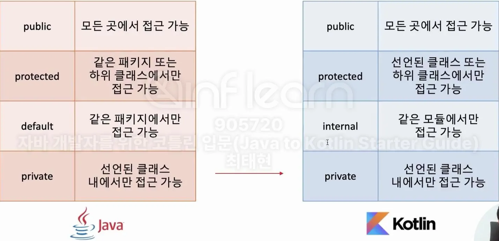
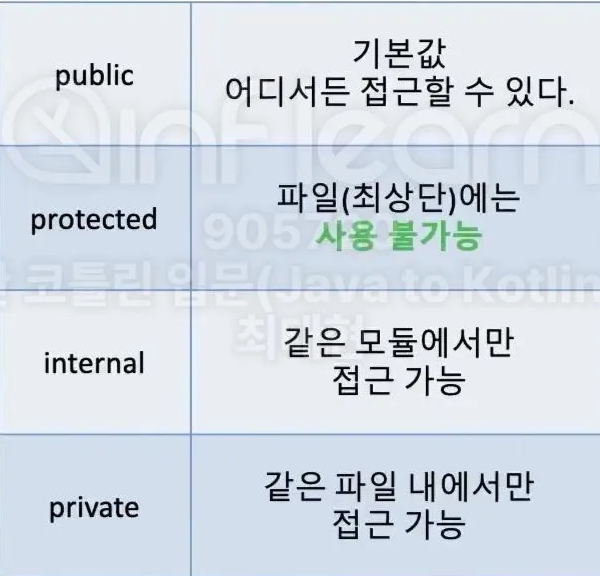

## 코틀린에서 접근 제어를 다루는 방법

### 1. 자바와 코틀린의 가시성 제어
코틀린에서는 패키지를 namespace를 관리하기 위한 용도로만 사용! 가시성 제어에는 사용되지 않는다.

[모듈] : 한번에 컴파일 되는 코틀린 코드
IDEA Module
Maven Project
Gradle Source Set
Ant Task <kotlin>의 호출로 컴파일 파일의 집합

- 자바의 기본 접근 지시어는 default
- Kotlin의 기본 접근 지시어는 public

### 2. 코틀린 파일의 접근 제어

- 코틀린은 .kt파일에 변수,함수, 클래스 여러개를 바로 만들 수 있다.
- public은 기본 값 어디서든 접근할 수 있다.
- protected 파일(최상단)에는 사용불가능
- internal에는 같은 모듈에서만 접근 가능
- private은 같은 파일에서만 접근할 수 있도록

### 3. 다양한 구성요소의 접근제어
- 생성자에 접근 지시어를 붙이려면, constructor를 써줘야 한다
- Setter에만 추가로 가시성을 부여할 수 있습니다

### 4. Java와 Kotlin을 함께 사용할 경우 주의할 점 