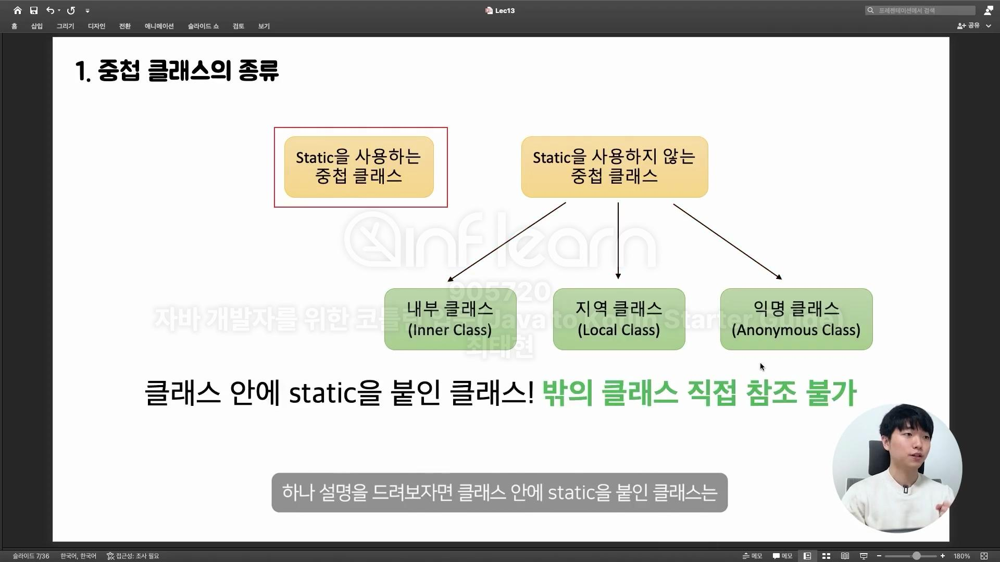

## 코틀린에서 중첩 클래스를 다루는 방법

### 1. 중첩 클래스의 종류

#### static을 사용하는 중첩 클래스
- 클래스 안에 static을 붙인 클래스, 밖의 클래스 직접 참조 불가

#### 내부 클래스(inner class)
- 클래스 안에 inner를 붙인 클래스, 밖의 클래스 참조 가능

#### 지역 클래스(local class)
- 메서드 안에 선언된 클래스

#### 익명 클래스(anonymous class)
- 일회성으로 무언가 쓸 때 사용

### 2. 코틀린의 중첩 클래스와 내부 클래스

#### Java의 내부 클래스(권장되지 않는 클래스 안의 클래스)

- 기본적으로 바깥 클래스를 참조하지 않는다.
- 바깥 클래스를 참조하고 싶다면 inner 키워드를 추가한다.

-------
- 코틀린에서는 클래스 안에 기본 클래스를 사용하면 바깥클래스에 대한 참조가 없고, 바깥 클래스를 참조하고 싶다면 inner키워드를 붙여야한다. 
- 코틀린 inner class에서 바깥 클래스를 참조하려면 this@바깥클래스명을 사용한다.